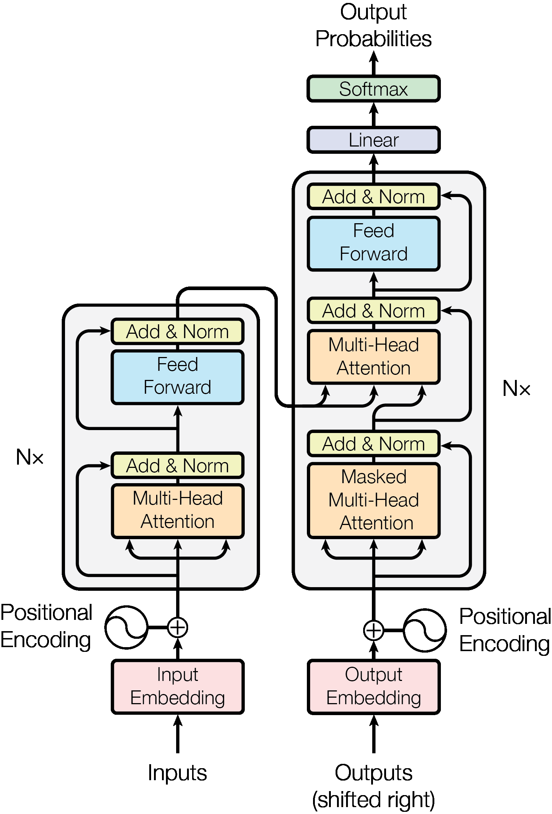
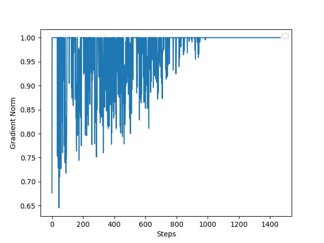

# Algerian Dialect GPT

This repository contains the implementation of a GPT model pre-trained on the Algerian dialect. The project aims to contribute to the underrepresented area of natural language processing (NLP) for dialects, with a focus on generating coherent and contextually relevant text in Algerian Arabic.

## Table of Contents

- [Model](#model)
- [Dataset](#dataset)
- [Training](#dataset)
- [Results](#results)
- [Usage](#usage)
- [Contributing](#contributing)


## Model architecture

This project uses a transformer decoder, pre-trained on a corpus of Algerian dialect text. The model is trained to generate text that is contextually relevant and adheres to the linguistic characteristics of the Algerian dialect.

<p align="center">
  
</p>

Tried to grasp the most of GPT2/GPT3 model settings in order to mimic those models, although i've had to set some of the pramaters to lower values given the fact that i'm training on MPS device.

### Config

```python
  vocab_size: 10240 # The tokenizer uses 10000 tokens only, but this is a better number because it's divisble by many powers of 2
  embedding_dim: 768
  n_layers: 12
  heads: 12
  head_size: 64
  block_size: 512
```

Additional info:
- Used pre-layer normalization as demonstarted by [!this paper](https://arxiv.org/pdf/2002.04745) instead of post-layer normalization as in the "Attention is all you need" paper.
- Tried adding dropout layers after every fully connected layer, it did not enhance training in this case, i also did not have any case of overfitting, hence the use of dropout was not ideal here.
- Just like in the GPT-2 paper, weights are being shared here between the embedding layer and the final linear layer.
- I am using Flash attention here for optimization purposes, there is a coded (but commented out) version of the self attention mechanism in model.py, put together with the help of Andrej Karpathy's videos.

## Dataset

I have used a huggingface [!dataset](https://huggingface.co/datasets/ayoubkirouane/Algerian-Darija), contains over 170k rows of the Algerian dilaect with each row contains a different number of tokens. The latter contains several french words and since we're taking baby steps here, i have decided to filter those out.
The dataset is also split between training and validation, leaving 10% to validation.

### Buidling a tokenizer

Used HuggingFace's pretrained GPT2 tokenizer, with a vocab size set to 10000 that i had to refine to a nice number later for training optimization purposes. Final training dataset of tokens is 3M (3003656 precisely) tokens.

Dataset is saved in .bin files, where each consists of 20 shards as a total.

## Training

At present time, i have only trained this on my Macbook M1 Pro, using [!Metal PErformance Shaders](https://developer.apple.com/metal/pytorch/) (MPS) device with Pytorch.

### Optimization
In a desperate attempt to optimize training as much as i can on an MPS device, i've tried several attempts:
- Mixed precision training, turns out MPS baclend from Pytorch does not support half precision.
- Used Flash attention
- Added gradient accumulation, to simulate a larger batch size than i can afford
- Reduced the context length hyparam, from 1024 to 512.

As a side info, also added gradient clipping after having visualized the gradient norm using L2-norm, the plot shows some instability there (see pikes from before clipping).

<p float="center">
  
   
</p>

### Validation
Every 20 training steps, a validation step is launched, validation loss is averaged over 4 validation batches.

### Config

```python
  steps: 1466
  gradient_accumulation_steps: 2
  epochs: 2
  val_steps: 4
  init_lr: 1e-3
  grad_clip: 1.0
  checkpoint_dir: checkpoints
```

- Training is running at a fixed learning rate for now, might add decay though in the next updates.
- Number of steps is computed using total length of the training dataset divided by the total number of iterations (gradient accumulation steps * batch size).

### Throughput
I've measured throughput as stated in this [!paper (Appendix B)](https://arxiv.org/pdf/2204.02311) i.e. using how many FLOPS we can get given the promised device's peak FLOPS measure. After the warm-up period, it seems that we're getting to 60% of what the MPS device can process in a second givent that the promised M1 Pro peak flops is measured "approximately" to 5.2 TFLOPS.

```bash
step  538 | loss: 3.238296 | dt: 396.05ms | tok/sec: 0.61
``` 

## Results
From the plot, i'm concluding a lack of correlation between the training and the validation data although it comes from the same dataset. There is room for further training as it shows in the plot that it hasn't hit convergence yet.

<p float="center">
  
</p>

## Constributions

Contributions are welcome! If you have suggestions or would like to contribute to this project, please open an issue to discuss what you would like to change.